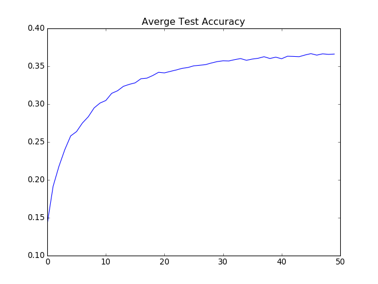

# Neural Text Classifier

This is an implementation of neural network text classifier which is a mix of two ideas:
- Hash Trick on Bigrams [arXiv:1607.01759 [cs.CL]](https://arxiv.org/abs/1607.01759)
- Fast Noise-Contrastive Estimation, [pdf link](http://www.isi.edu/natural-language/mt/simple-fast-noise.pdf)

Resulting model can be used to obtain vector representation of a text in feature space.

(Consider this as a research project only)

## Dependencies

- Python 2.7
- Numpy (tested on 1.11.1)
- Scipy (tested on 0.13.3)
- h5py (tested on 2.6.0)

## Data

The model trained on Wikipedia pages. I use article heads and category labels as input data and target variables.

Some Wikipedia pages are labeled with specific categories, used by wiki editors. Theses and rare (< 100 articles) category labels filtered out. Also, many pages are related to multiple categories - in this case I leave only most specific label (whichever is less frequent).

Final training dataset consists of 
- 2,213,318 articles
- 12,788 labels

## Model

The model is basically a simple neural network with single hidden layer, ReLU and (approximated) softmax criterion.

### Parameters
- Dictionary size: 44,679 words
- Bigram hash space size: 8,388,608
- Hidden layer size: 64 neurons

NCE criterion requires K negative samples. This implementation shares samples among chosen for minibatch, so K <= batch_size-1.

Training takes ~10 minutes/epoch on CPU only (Hard to tell exact time, CPU is half busy with other project right now) 

### Running
Download data
```
src/download_data.sh
```

Init dataset
```
python src/init_dataset.py
```

Train the mode
```
python src/train_model.py
```
By default resultings will be saved to *./cache/model* directory

## Results

I trained it for 50 epoch using RMSProp optimization. I got Top-1 accuracy (averaged over all labels) up to ~36% on test subset which is not so bad considering small hidden layer size (still need to check it with larger settings) and large number of labels. For baselines and comparison with other methods I refer to [original paper](https://arxiv.org/abs/1607.01759). The authors have also released pretty fast implementation (https://github.com/facebookresearch/fastText).



I have used [BBC news articles](http://mlg.ucd.ie/files/datasets/bbc-fulltext.zip) to see if it can capture topics on a completely different dataset. Here is how it looks like with colored truth article topics. 


The model can be used for topic classification, but not other problems - e.g. it cannot capture tweet sentiments right away. In that case I would try to use different data, like predict hash tag based on tweet text.

## License

MIT
